# Shopify Home Page Clone
A shopify home page clone made using HTML and Tailwind CSS

## What have I learnt from this project?
- Tailwind CSS

## Time Taken for Completion
- 5 hours

### Checkout the Project here : [shopify](https://re-shopify.netlify.app/)

## Output

## Desktop View
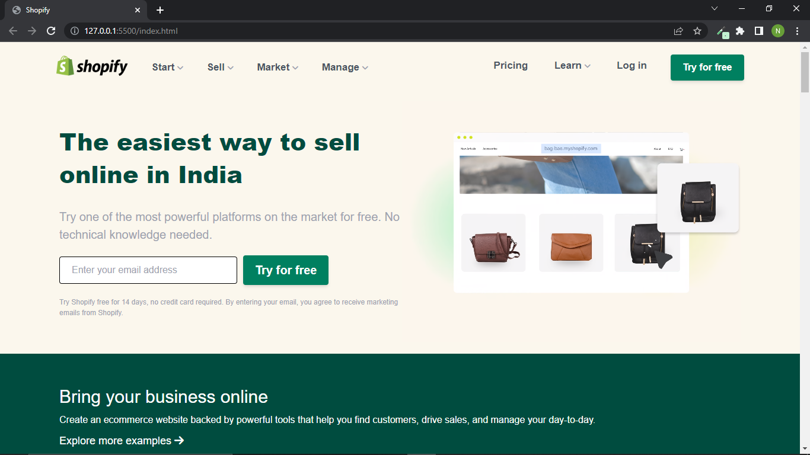
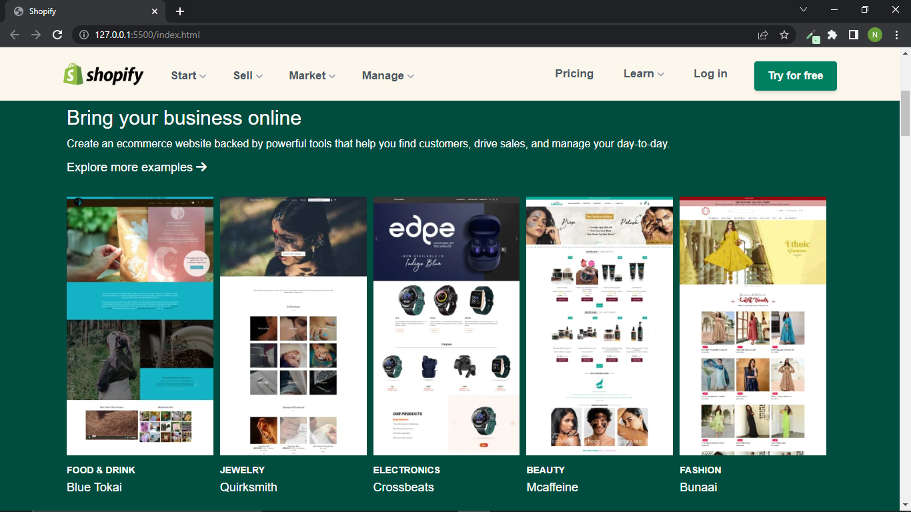
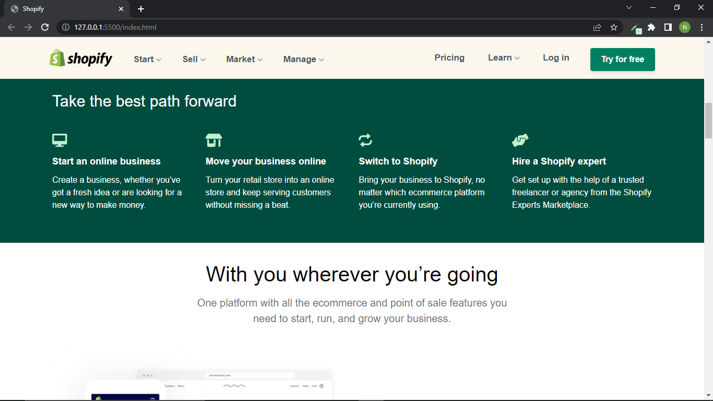
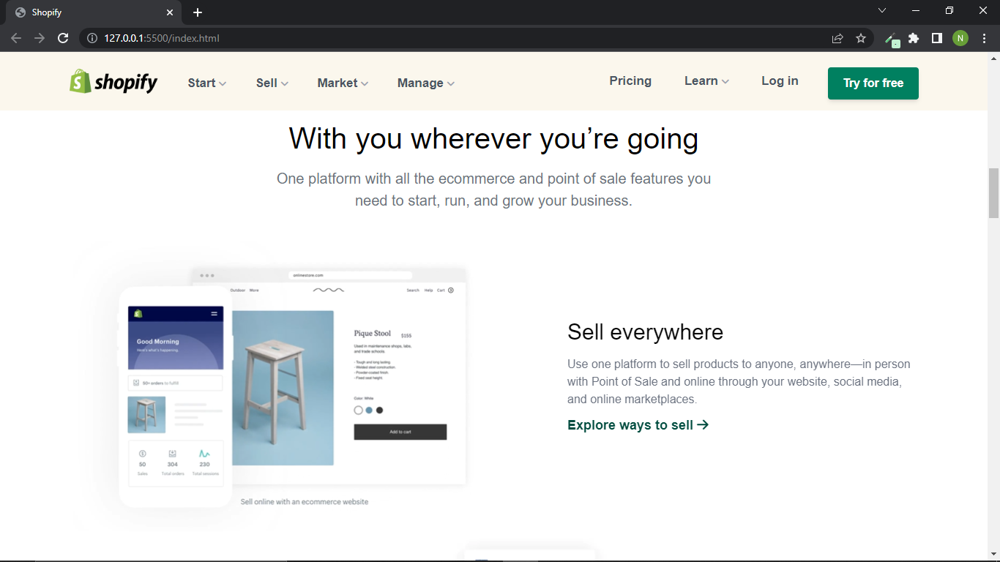
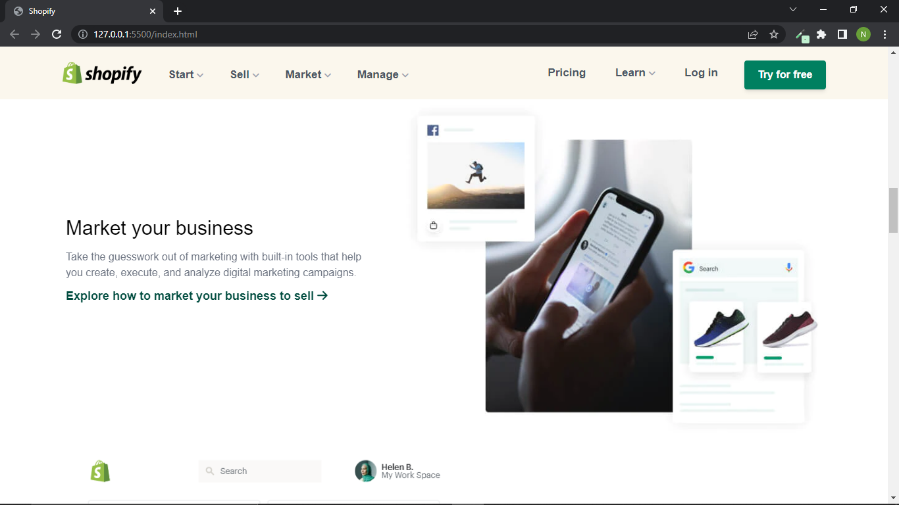
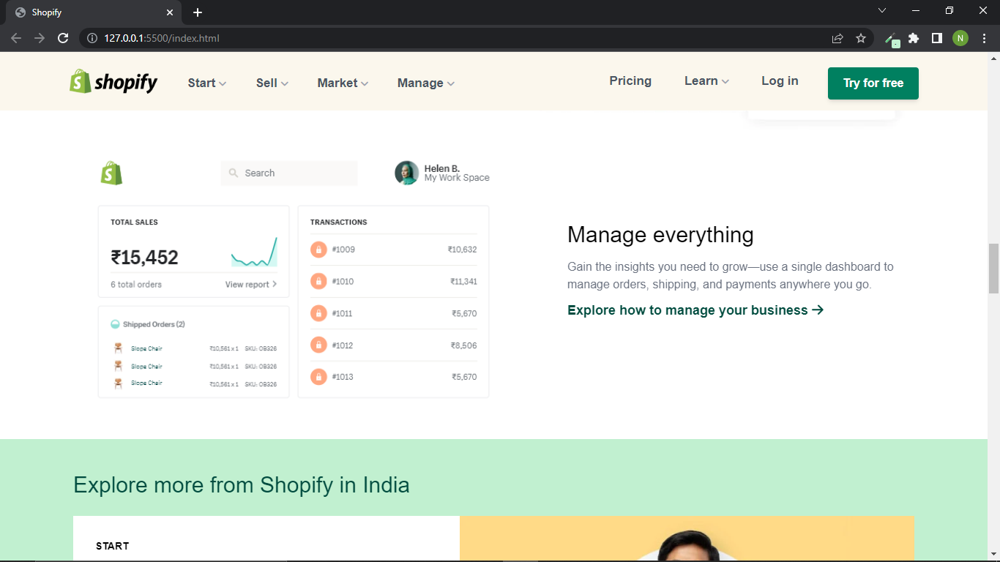
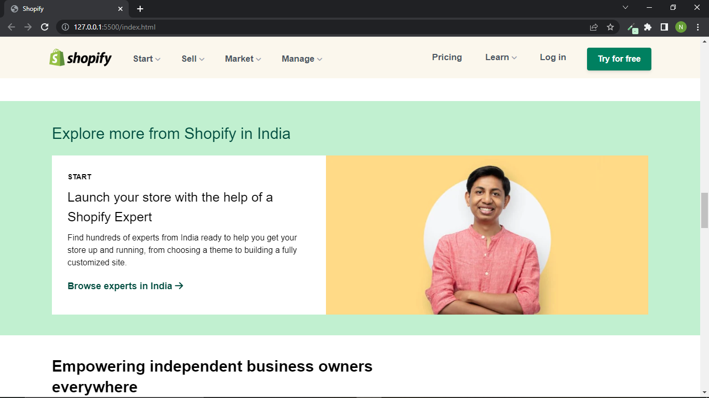
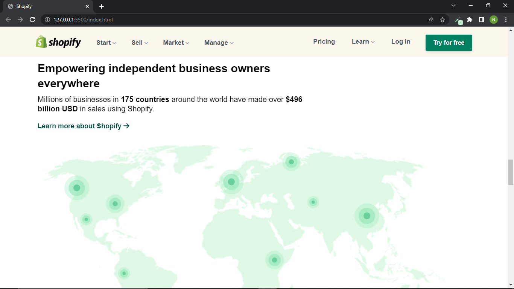
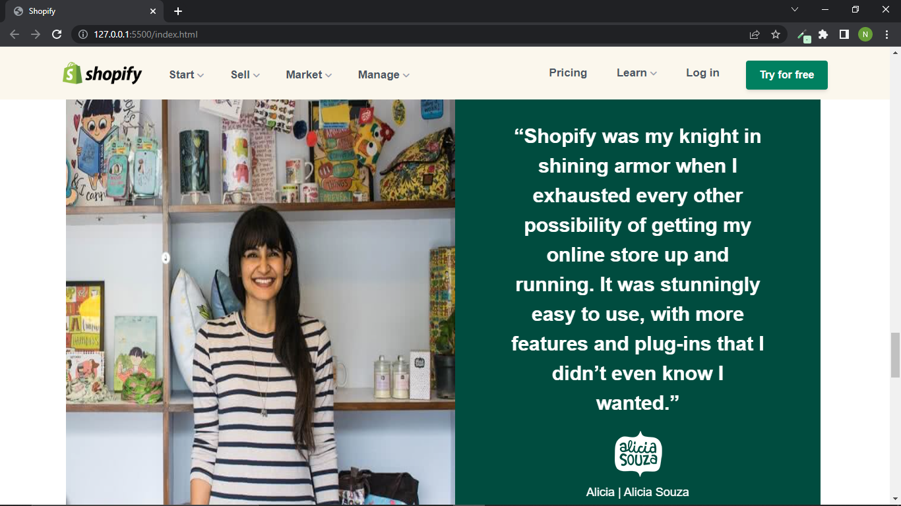
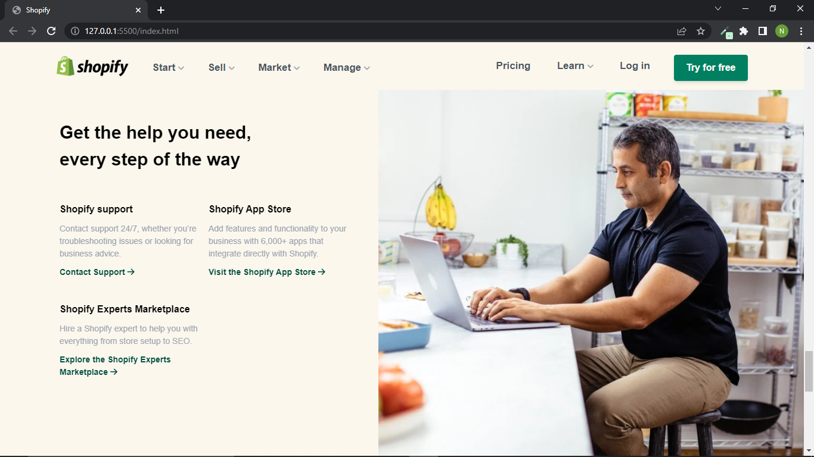
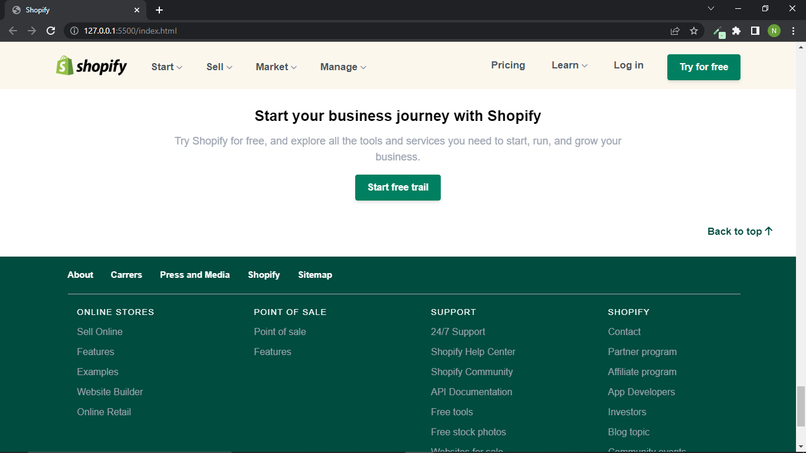

Made with ❤️ by Nisarg Shah

